[回文数](#回文数)<br>
[アルゴリズムとデータ構造](#アルゴリズムとデータ構造)<br>

- [アルゴリズム](#アルゴリズム)<br>
- [データ](#データ)<br>
- [データ構造](#データ構造)<br>
- [連結リスト](#連結リスト)<br>
- [配列](#配列)<br>
- [スタック](#スタック)<br>
- [キュー](#キュー)<br>
- [具体的なアルゴリズムの例](#具体的なアルゴリズムの例)<br>

[ウェブサーバ](#ウェブサーバ)<br>

## 回文数

- Palindromic number
- 各位の数を反転させた整数が元の整数と等しい
- 偶数桁の回文数は 11 の倍数（例:10001）

## アルゴリズムとデータ構造

> https://zenn.dev/masahiro_toba/books/436c018f5cd4e2
>
> https://sevendays-study.com/algorithm/

### アルゴリズム

- 概要

  - 一定のルールに基づいて、目的を達成するや問題を解決するための手段（作業手順）

- 特徴

  - 目に見えない抽象的なアイディアであり、考え方の概念
  - 正しい結果が得られ、終わりがある作業手順（**正当性と停止性**）
  - アルゴリズムを実行する主体は、考える必要はなく、仕組みを知る必要もない

  ```text
  → アルゴリズムとは、ある問題を解決するための有限回の操作による手続き
  ```

- アルゴリズムとプログラムの関係

  - プログラムとは、アルゴリズムに基づき具体的な形（目に見えるもの）に表したもの
  - アルゴリズムの概念は 3000 年以上の歴史がるに対して、プログラムの概念は 200 年程度の歴史である

    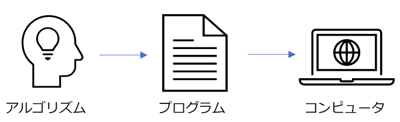

- アルゴリズムの三大処理

  - 順次処理：処理を順番に実行する
  - 分岐処理：条件により処理の流れを分岐させる
  - 繰り返し処理：条件が成立する間処理を繰り返す

  ```text
  → アルゴリズムは必ず上記の3つの組み合わせから構成され、この3つの処理を組み合わせてプログラムを設計する方法論のことを、構造化プログラミングという
  ```

- アルゴリズムの性質

  - 正当性

    - 与えられた課題に対して正しい結果を返すことをアルゴリズムの `正当性` という
    - 正当性は、アサーションを用いて判定する方法がある

  - 停止性

    - 最終的には必ず正しく停止することをアルゴリズムの `停止性` という ⇌ 永遠に繰り返される処理 `無限ループ`
    - 低姿勢は、反復処理の終了条件の判定に使用される変数を確認し、必ず有限回数の繰り返しで終了条件が成立するか判定する方法がある

- Tips

  - 1800 年の中頃、世界で初めてコンピュータが作られた
  - 世界最初のアルゴリズムは、シュメール人が粘土板に書き残した「収穫した穀物を複数の人間で平等に分配する方法」だと言われている

### データ

- 概要

  - 0 と 1 の電気信号であり、それらはメモリ IC の中に保存されている
  - データをグループ分けしたものを `データ型` という

- メモリ IC の物理的な仕組み

  - メモリ

    - プログラムやデータを記憶する装置
    - 半導体素子を利用して電気的に記録を行う（機器の電源を切ると内容が失われる）
    - データを保存する領域を `変数` という

  - IC

    - 半導体集積回路

  - メモリ IC

    - A0 ～ A9 まで 10 本のピンがあり、これらのピンによってデータを保存する

    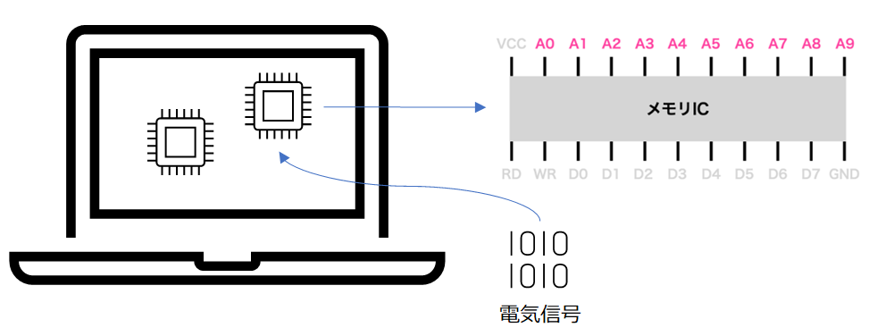

- メモリ IC の論理的な仕組み

  - 01 の電気信号ではなく、ビルディングとして考える
  - 1 フロア 1 バイトのビルをイメージする（1024 階建てで 1K バイト保存できる）

    - 例）4 バイトの int 型のデータを保存する

      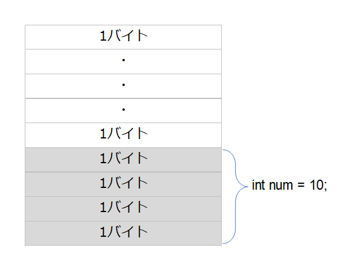

### データ構造

- 概要

  - データを効率的に扱うための組み合わせ（構造）のこと
  - 様々なデータ構造が存在する
    - 例）キュー, 構造体, 階層構造, スタック, 配列, 連結リストなど

- 特徴

  - 目的や用途に応じて、データの形を変幻自在に変えることができる

- アルゴリズムとデータ構造の関係

  - データ構造とは、アルゴリズムで使用されるデータの取り扱い方法のこと

- データ構造とポインタ

  - ポインタはアドレスを指し示す仕組みであり、ポインタのアドレスを使用しデータに辿り着く

    - 例）\*p の中に num のアドレスが入っていて、そこを辿り値を取得する

    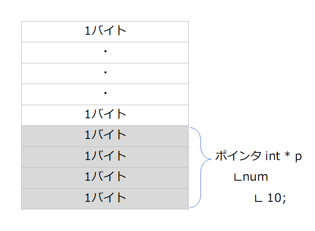

### 連結リスト

- 概要

  - リスト構造と呼ばれるデータ構造の 1 つであり、1 つの要素の中に、データと次のデータのアドレス（ポインタ）がセットで保存されている
  - 単方向リスト, 循環リスト, 双方向リストの 3 つが存在する

- 特徴

  × 目的のデータを見つけるために、1 つずつ要素を辿る必要があるため、データの探索に時間がかかる

  ○ 追加や削除などデータの移動が柔軟にできる

    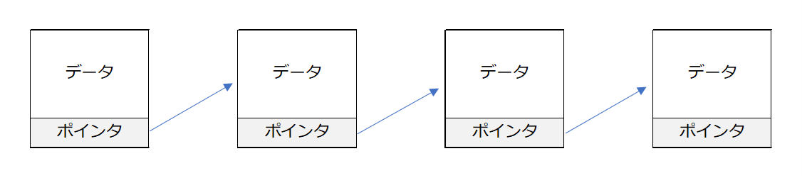

- 単方向リスト

  - 各要素は次の要素へのポインタを持つ
  - 最後の要素のポインタは null

    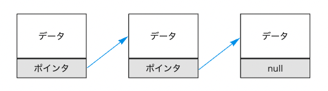

- 循環リスト

  - 最後の要素は、先頭の要素のポインタを持つ
  - ポインタを辿って終端まで来ると再び先頭に戻る

    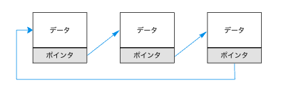

- 双方向リスト

  - 各要素は前後の要素へのポインタを持つ
  - 先頭と終端をつなぎ合わせると、双方向の循環リストを作成できる

    

### 配列

- 概要

  - データ構造の 1 つであり、同じ型の要素（データ）が大量に並んでいて、効率的にデータを扱うことができる

  ○ 各要素は、添字を持っていて、添え字を指定することで瞬時にデータにアクセスできる

  × 全ての要素が連続した位置にある必要があるため、データの移動や変更が容易でない

  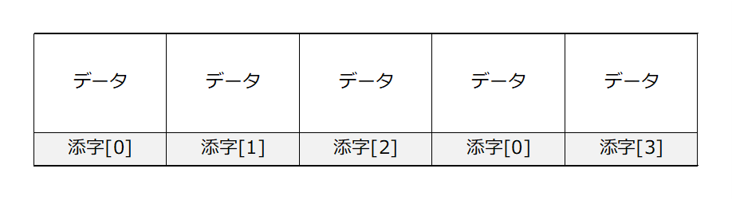

### スタック

- 概要

  - データ構造の 1 つであり、リストの先頭のみ要素の挿入と削除が行われる
  - 最後に挿入した要素を最初に取り出すことができる
  - スタックの途中のデータを取り出すことはできない

    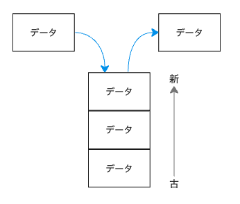

    ```text
    → LIFO（Last In, First Out）
    　Excel等の「元に戻す」操作は、スタックの仕組みが使われている
    ```

- プッシュとポップ

  - push：データを積む（追加する）ことプッシュという
  - pup：スタックからデータを取り出すことをポップという

### キュー

- 概要

  - スタックの正反対の概念
  - 最初に挿入したデータが、最初に取り出すことができる

    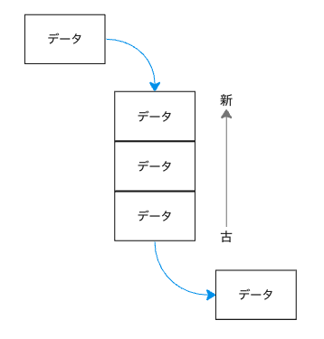

    ```text
    → FIFO（First In First Out）
    　印刷機のジョブや、予約のキャンセル待ち等にキューの仕組みが使われている
    ```

- リングバッファ

  - FIFO を続けているとメモリ が枯渇してしまうため、リングバッファというメモリを再利用する仕組みが使われる
  - キューのデータが満タンで新しいデータを格納できない場合、既に処理済みのメモリにデータが上書きされる

    

### 具体的なアルゴリズムの例

- 時間の差分

  - 時間を秒に変換

    ```text
    h:m:s = h * 3600 + m * 60 + s
    ```

  - 秒数（t）を時間に変換

    ```text
    1. t / 3600 → hに代入
    2. 上記の余り / 60 → mに代入
    3. 上記の余り → sに代入
    ```

- 配列の値の合計

  ```text
  1. 合計値（sum）と配列の添字（n）を用意する
  2. sumにn番目の要素を足す
  3. nが配列の要素数を超えていない限り繰り返す
  ```

- 配列の値の最大値

  ```text
  1. 最大値（max）と配列の添字（n）を用意する
  2. maxにn番目の要素を代入
  3. maxと次の要素を比較し、大きければ再代入する
  3. nが配列の要素数を超えていない限り繰り返す
  ```

- 最大公約数

  - ユークリッドの互除法（アルゴリズム）を用いて求める

    - 前提：最大公約数を求めたい 2 つの整数（m, n）は、m>n であると仮定する

    ```text
    1. 変数dを用意する
    2. mとnの割り算の余りをd代入する
    3. dが0なら、nを最大公約数として出力する
    4. mにnの値を代入する
    5. nにdの値を代入する
    6. 手順1に戻る
    ```

    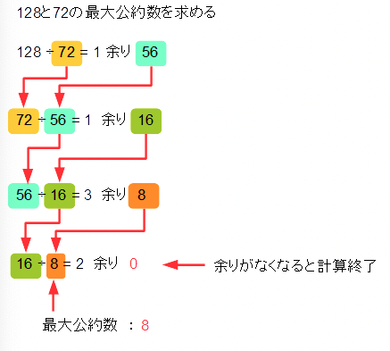

  - Tips
    - 約数：ある整数を割り切れることができる整数のこと
    - 公約数：複数の整数が共通して持つ約数のこと
    - 最大公約数：複数の整数が共通して持つ約数のうち、最も大きい約数のこと

- 素数

  - エラトステネスのふるい（アルゴリズム）を用いて求める

      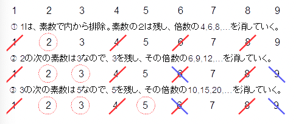
      <br>
      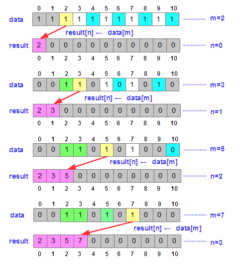

- Tips

  - 素数：1 とその数以外に正の約数を持たない自然数のこと
  - 特徴

    - 約数が 1 と自分自身のみ（左記以外の数の積として表せない）
    - 無限に存在する（素数の無限性）

    ```text
    → 素数は数学や暗号学などの分野で重要な役割を持っており、RSA暗号（素数を掛けあわせた数字の素因数分解の仕組みを利用した暗号技術）などがセキュリティ技術に利用されている
    ```

## ウェブサーバ


### Apache - Apache HTTP Server

- 概要

  - 1995 年にリリース
  - 代表的な Web サーバーのソフトウェアの 1 つ
  - Apache の設定は `httpd.conf` に記入する

- 特徴

  - マルチプロセス
  - １リクエストに対して１プロセスの処理が実行される
    - 例）100 の同時接続がある場合、100 のプロセスが必要

- C10K 問題（クライアント 1 万台問題）

  - 同時接続するクライアントが多すぎると、ソフトウェア上の問題によりサーバーがパンクしてしまうこと

- メリット

  - 簡単に機能拡張できる
  - 信頼性・安定性が高い
  - 開発者向け技術情報を入手しやすい
  - 重い処理が得意

- デメリット

  - メモリを大量に消費する
  - 同時処理数が多くなると耐えられない

### Nginx - エンジンエックス

- 概要

  - 2004 年にリリース
  - C10K 問題をきっかけに開発が始まった

- 特徴

  - シングルスレッド

- メリット

  - 速くて高負荷に強い
  - リバースプロキシやロードバランサの機能がある
  - 柔軟にカスタマイズ可能

- デメリット
  - CPU リソースがたくさん必要な処理は不向き
  - Nginx 単体で完結させるのは難しい
  - 機能が少ない
  - ソースコードが複雑

```text
少量の同時接続数で重い処理をしたい　→ Apache
大量の同時接続数や軽い静的コンテンツを作成したい　→ Nginx
```
