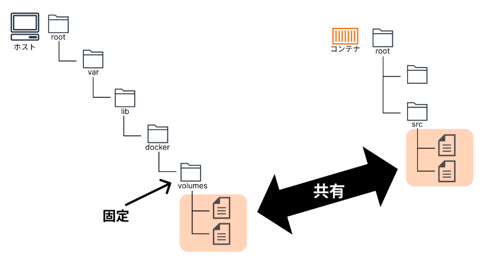
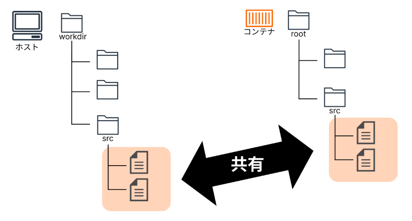

### ボリューム - Volumes

> https://docs.docker.com/storage/volumes/

- 概要

  - ボリュームとは、データを永続的に管理できる仕組みのこと
  - ホストマシンとデータを共有する方法の 1 つ

    - Docker の管理下（固定）でストレージ領域を確保する
    - Linux の場合、/var/lib/docker/volumes 以下をコンテナから参照する
    - 他：[volume](#バインドマウント---bind-mounts), tmpfs mount

      

```
コンテナを削除または更新した場合、コンテナ内のデータは消えてしまう
  ↓
データを永続化したい場合、コンテナ外にデータを保管する（ = ボリューム）
  〇 複数のコンテナ間で共有
  〇 ホスト間で移行
```

- ボリュームの種類

  - 名前付きボリューム：ユーザー定義の任意の名前を持つ　※推奨

    ```bash
    docker volume create <ボリューム名>
    ```

  - 匿名ボリューム：自動で一意の ID が割り当てられる

- Tips

  - Docker のデータディレクトリを確認

    ```bash
    docker info | grep "Docker Root Dir"
    ```

  - ボリューム一覧を表示

    ```bash
    docker volume ls
    ```

  - ボリューム詳細を表示

    - Mountpoint：ホストマシン上のボリュームの実際のパス

    ```bash
    docker volume inspect <ボリューム名>
    ```

  - ボリュームを削除

    ```bash
    docker volume rm <ボリューム名>
    ```

  - 未使用のボリュームを削除

    ```bash
    docker volume prune
    ```

### バインドマウント - Bind mounts

> https://docs.docker.com/storage/bind-mounts/

- ホストマシン上のディレクトリをコンテナ内のディレクトリと共有する

  × ホストマシンのディレクトリ構造と OS に依存する<br>
  × ボリュームに比べて機能が制限されている

  

### PHP イメージの種類

- php:<バージョン>-apache
  - PHP と Apache を組み合わせた Web アプリケーションを作成したい
- php:<バージョン>-fpm
  - PHP-FPM を使用して PHP と web サーバー（Apache 以外 Nginx 等）と組み合わせた Web アプリケーションを作成したい
- php:<バージョン>-cli
  - コマンドラインスクリプトを実行するための PHP 環境が欲しい
  - 独自の PHP スクリプトやツールを作成したいなど
- php:<バージョン>-alpine
  - Alpine Linux ベースの軽量な PHP 環境が欲しい
